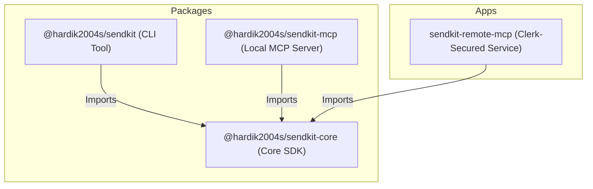

# Sendkit

[](https://www.npmjs.com/package/@hardik2004s/sendkit)
[](https://www.npmjs.com/package/@hardik2004s/sendkit)
[](https://opensource.org/licenses/MIT)

**Sendkit** is an AI-native messaging and notification toolkit. It provides a modular suite of tools designed to send notifications (starting with Telegram) seamlessly across multiple contexts: via a Command Line Interface (CLI), a local Model Context Protocol (MCP) server, or a securely authenticated remote/cloud MCP server.

By leveraging the Model Context Protocol (MCP), Sendkit allows Large Language Models (LLMs) and AI agents to securely and natively interact with messaging channels.

---

## 🌟 Significance & Key Features

- **AI-Native (MCP Ready)**: Built from the ground up to support the Model Context Protocol, enabling LLMs (like Claude, Gemini, etc.) to trigger messaging tools securely.
- **Strict Type Safety**: Powered by **TypeScript** and **Zod** to guarantee schema validation for all message operations.
- **Flexible Deployments**: Use it as a quick CLI tool, connect it locally to your AI assistant, or deploy it as a multi-tenant cloud microservice.
- **Secure Cloud Gateway**: Integrates with **Clerk Auth** to prevent unauthorized usage and ensure only authenticated AI sessions can access the messaging tools.
- **Monorepo Architecture**: Efficiently managed via **Bun Workspaces** for fast development, typechecking, and builds.

---

## 🏗️ Architecture & Modules

Sendkit is structured as a monorepo consisting of core libraries, consumer packages, and services.



### 1. Core SDK (`@hardik2004s/sendkit-core`)

The foundation of the entire toolkit. It defines the schemas, types, and logic for sending messages.

- **Tech Stack**: TypeScript, Zod, Fetch API.
- **Role**: Exposes Zod schemas for input validation (`telegramMessageInputSchema`, `telegramMessageOptionsSchema`) and the core `sendTelegramMessage` operation.

### 2. CLI Tool (`@hardik2004s/sendkit`)

A developer-friendly CLI to send notifications directly from your terminal.

- **Tech Stack**: Commander, Zod.
- **Role**: Manages local token configurations (`~/.config/sendkit/config.json`) and triggers notifications.

### 3. Local MCP Server (`@hardik2004s/sendkit-mcp`)

A standard Model Context Protocol server that runs locally on your machine over stdio transport.

- **Tech Stack**: `@modelcontextprotocol/sdk`.
- **Role**: Exposes the `telegram` tool to local AI agents (e.g., Claude Desktop, Cursor) using the local environment's `TELEGRAM_BOT_TOKEN`.

### 4. Remote MCP Server (`apps/remote-mcp`)

A cloud-deployable Hono HTTP server providing a Clerk-authenticated remote MCP server.

- **Tech Stack**: Hono, `@clerk/backend`, `@clerk/mcp-tools`.
- **Role**: Authenticates users using Clerk bearer tokens, maps request parameters to custom Telegram bot tokens (`/:botToken/mcp`), and serves MCP requests dynamically over standard web streams.

---

## 📂 Code Structure

```bash
sendkit/
├── apps/
│   └── remote-mcp/                 # Remote MCP application (Hono + Clerk)
│       └── src/
│           └── index.ts            # Entrypoint & OAuth validation
├── packages/
│   ├── core/                       # Core notification engine
│   │   └── src/
│   │       ├── index.ts
│   │       ├── operations.ts       # Telegram API actions
│   │       └── schemas.ts          # Zod structures
│   ├── cli/                        # Sendkit CLI tool
│   │   └── src/
│   │       └── index.ts            # CLI command parser
│   └── local-mcp/                  # Local Stdio MCP server
│       └── src/
│           └── index.ts            # Stdio transport + MCP tool registry
├── package.json                    # Workspace definitions & run scripts
└── tsconfig.json                   # Base TS configuration
```

---

## 🚀 Installation & Usage

### 1. Command Line Interface (CLI)

Install the CLI globally from npm:

```bash
npm install -g @hardik2004s/sendkit
```

Configure your Telegram bot token:

```bash
sendkit init --telegram-bot-token <your-bot-token>
```

Send a Telegram message:

```bash
sendkit telegram <chat-id> "Hello from Sendkit CLI!"
```

---

### 2. Local MCP Server

Run the MCP server locally with your favorite AI client (configured with stdio transport):

```json
{
  "mcpServers": {
    "sendkit-mcp": {
      "command": "npx",
      "args": ["-y", "@hardik2004s/sendkit-mcp"],
      "env": {
        "TELEGRAM_BOT_TOKEN": "your-bot-token"
      }
    }
  }
}
```

---

### 3. Remote Clerk-Secured MCP Server

Deploy the server in `apps/remote-mcp` to a serverless platform (e.g., Cloudflare Workers, Fly.io, or Vercel).

**Required Environment Variables**:

- `CLERK_PUBLISHABLE_KEY`: Clerk Frontend API Key
- `CLERK_SECRET_KEY`: Clerk Backend API Key
- `PORT`: Server port (defaults to 3000)

---

## 🛠️ Development

This project is optimized to run with **Bun**.

### Set Up Workspaces

```bash
bun install
```

### Dev Command Execution

- **Run CLI in dev mode**: `bun dev:cli`
- **Run Local MCP**: `bun dev:local-mcp`
- **Run Remote MCP**: `bun dev:remote-mcp`

### Formatting & Linting

We use **oxlint** and **oxfmt** for ultra-fast validation:

```bash
bun run lint      # Lint checks
bun run format    # Format code
```

---

## 📄 License

This project is licensed under the MIT License - see the LICENSE file for details.
